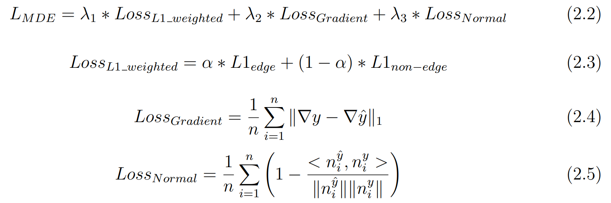

# Improving Seedling Detection by Predicting Height Information

## Description

Improving Seedling Detection of conifer seedlings along seismic lines with addition of predicted height information to drone images.

See paper [here](https://github.com/AlexanderDobra/SeedlingDetection/blob/main/images/Bachelorthesis_Alexander_Dobra.pdf) for further clarification.

CNN Models used:
- Object Detection:
  - Vanilla Model (used for comparison to Pre-RPN):
    - Basic Faster R-CNN with ResNet50-FPN-Backbone
    - **Inputs/Outputs**: Images ⮕ Detections
  - Pre-Region Proprosal Network (Pre-RPN):
    - Modified Vanilla Model derived from [here](https://github.com/JasonJooste/seedlings_height)
    - **Inputs/Outputs**: Images + Depth Maps ⮕ Detections
- Monocular Depth Estimation:
  - MDE Network:
    - Modified ResNet101-FPN
    - **Input/Outputs**: Images ⮕ Depth Prediction Maps

## Object Detection Architecture

## Monocular Depth Estimation Architecture

## Loss Function for MDE Network

See paper [here](https://github.com/AlexanderDobra/SeedlingDetection/blob/main/images/Bachelorthesis_Alexander_Dobra.pdf) for further clarification.

## Results

See paper [here](https://github.com/AlexanderDobra/SeedlingDetection/blob/main/images/Bachelorthesis_Alexander_Dobra.pdf) for further clarification.

### Visualising Bounding Boxes

Pretrained Pre-RPN over 35 epochs (2 samples of validation set) on different settings of the box_predictor layers:
 

### Visualising Depth Estimations

### Object Detection with Monocular Depth Estimation

### Codereferences
will be updated

